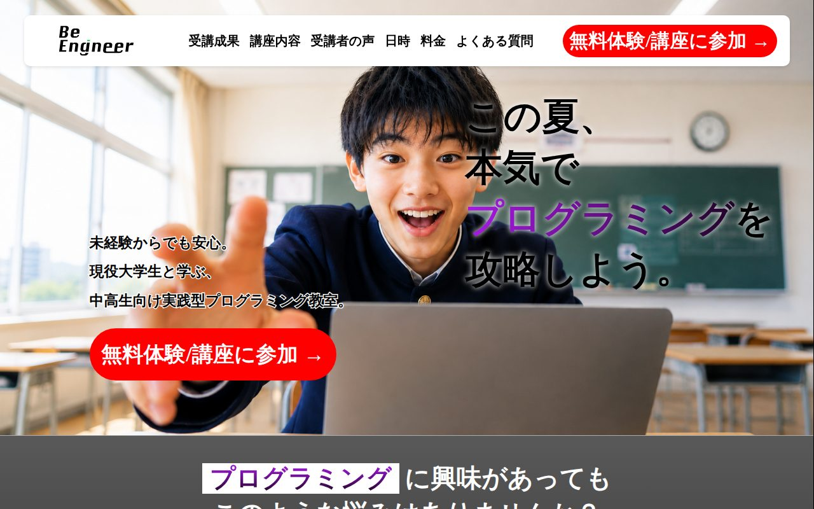
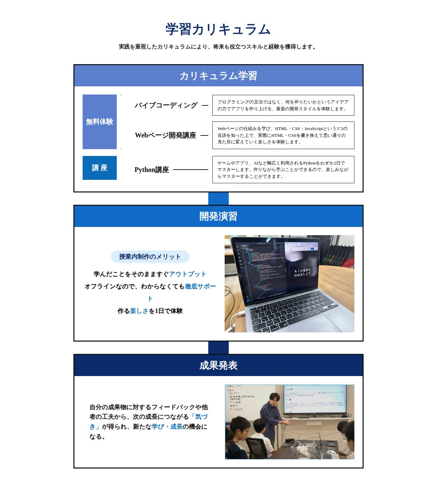
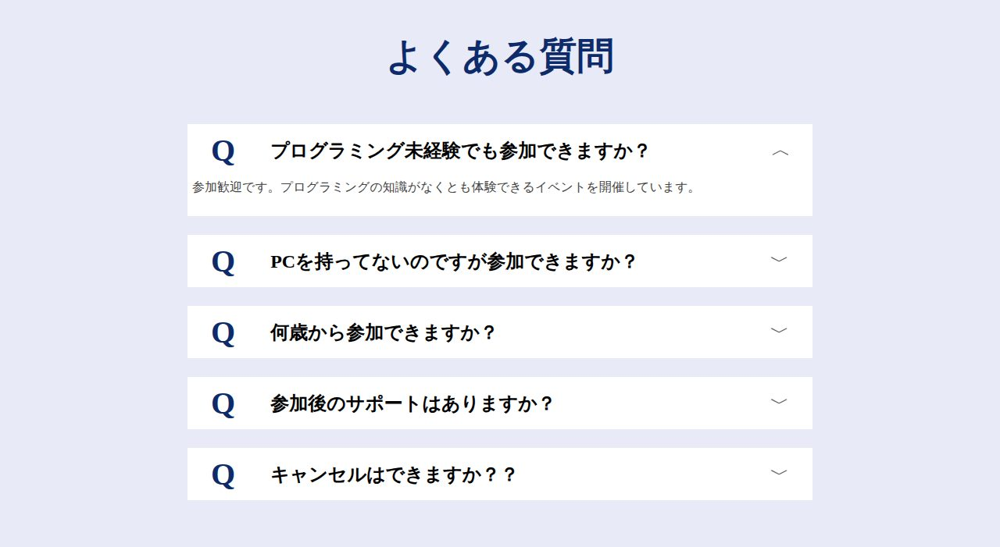
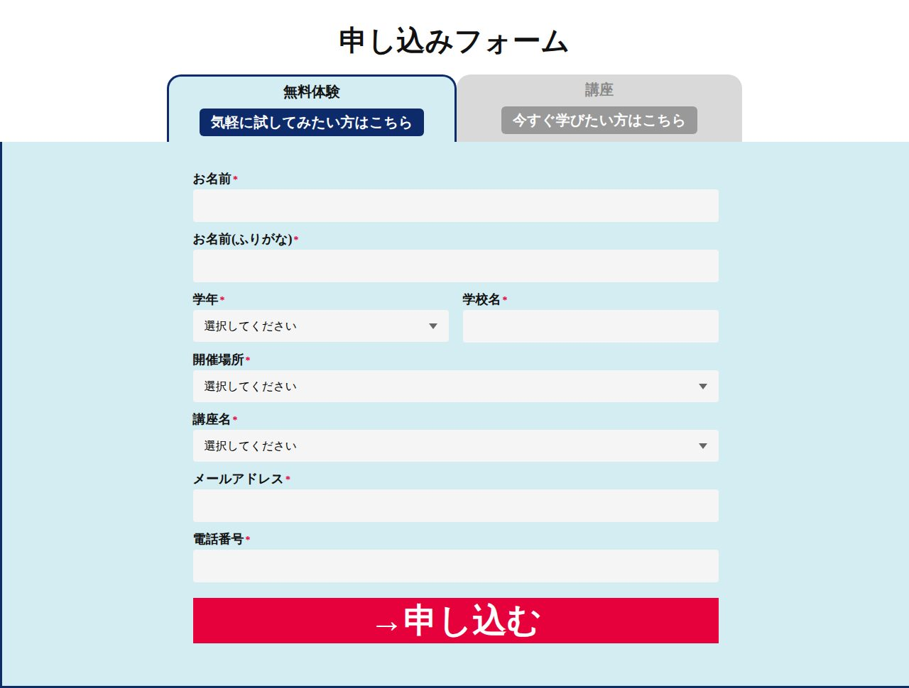
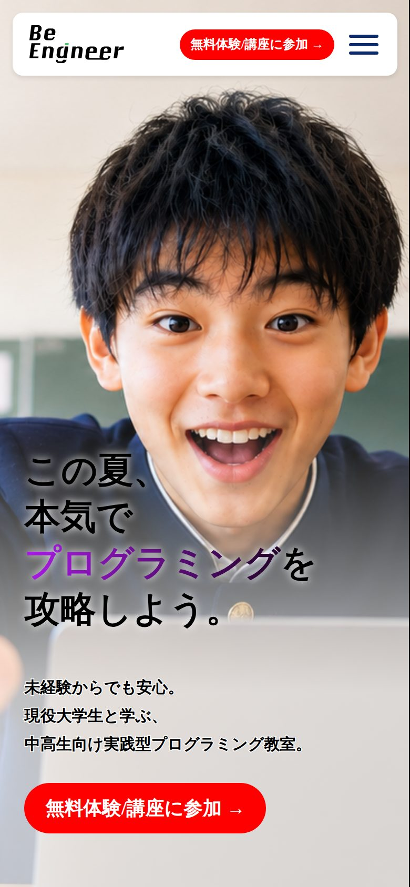

# BeEngineer ランディングページ（niwaLP）

中高生向けプログラミング教室「BeEngineer」の無料体験・講座への申し込みを集めるための、1ページ完結のランディングページ（LP）です。

**公開ページ → https://niwayukun-1234.github.io/niwaLP/**



*トップのファーストビュー（PC表示）。キャッチコピーと申し込みボタンを最初に見せています。*

## スクリーンショット

| 学習カリキュラム | よくある質問 |
| --- | --- |
|  |  |
| 無料体験 → 講座 → 開発演習 → 成果発表の流れを図で説明 | 質問をタップすると答えが開くアコーディオン |

| 申し込みフォーム | スマホ表示 |
| --- | --- |
|  |  |
| 「無料体験」と「講座」をタブで切り替え | スマホでは縦並びのレイアウトとハンバーガーメニューに切り替わります |

## どんなページ？

BeEngineer は、現役大学生が講師を務める中学生・高校生向けのプログラミング教室です。
このページは「プログラミングに興味はあるけど、自分にできるか不安」という中高生（とその保護者）に向けて、
不安を受け止める → 何が学べるかを見せる → 実際の声で安心してもらう → 料金や日程を確認 → 申し込む、
という順番で読み進めてもらえるように作りました。

フレームワークやライブラリは使わず、HTML・CSS・JavaScript をすべて手書きしています。

## ページの構成と、その順番にした理由

上から順に、次のセクションが並んでいます。

1. **ファーストビュー**：「この夏、本気でプログラミングを攻略しよう。」というキャッチコピーと申し込みボタン
2. **悩み**：「何から始めればいいか分からない」「数学が苦手でも大丈夫？」など、よくある不安を先に言葉にする
3. **受講成果**：BeEngineer で身につくこと（実践的なITスキル・自分だけのツール作り・同年代のコミュニティ）
4. **申し込みボタン（1回目）**
5. **選ばれる理由**
6. **学習カリキュラム**：無料体験（バイブコーディング / Webページ開発）→ Python講座 → 開発演習 → 成果発表
7. **こんな人におすすめ**
8. **申し込みボタン（2回目）**
9. **受講者の声**：生徒の声カードが横に流れるカルーセル
10. **受講までの流れ**：申し込み → 事前確認 → 当日参加の3ステップ
11. **日時・場所・料金**：「無料体験 / 講座」の切り替えと、校舎タブ
12. **よくある質問**
13. **申し込みフォーム**

「不安 → 解決策 → 証拠（声）→ 条件（日時・料金）→ 疑問の解消（FAQ）→ 行動（フォーム）」という流れにして、読み手が迷ったところで疑問が解けるように並べています。
申し込みボタンはヘッダーとページの途中にも置き、どこで「申し込みたい」と思ってもすぐフォームへ飛べるようにしています。

## デザイン・実装のポイント

- **スマホ・タブレット対応（レスポンシブ）**：1120px / 1024px / 768px などのブレークポイントでレイアウトを切り替え。スマホではナビをハンバーガーメニューにまとめています（`aria-expanded` で開閉状態も管理）。
- **受講者の声の自動カルーセル**：カードを複製して前後につなぎ、継ぎ目なく無限ループするように実装。2段のうち1段目は左へ、2段目は右へ流れます。画面幅が変わったときや、ブラウザの「戻る」でページが復元されたとき（bfcache）にも位置を測り直します。
- **「無料体験 / 講座」の切り替え**：日時・料金セクションのトグルで日程と料金表示が連動して切り替わります。
- **校舎タブ**：タブを押すと住所・アクセス・電話番号・Googleマップの埋め込みが切り替わります（データが入っているのは梅田校・京大本校の2校分）。
- **FAQ のアコーディオン**：1つ開くと他は自動で閉じ、`max-height` のアニメーションでなめらかに開閉します。
- **申し込みフォームのタブ**：「無料体験」では講座名を選択式に、「講座」では講座名を固定表示にし、必須項目の扱いも切り替えています。
- **favicon・OGP**：BeEngineer の「B」ロゴから favicon / apple-touch-icon を作り、SNS でシェアされたときに表示される OGP 画像（1200×630）も設定しています。

> 補足：このページはフロントエンドのみの制作物です。申し込みフォームの送信先（サーバー側の処理）はつないでいないため、入力しても実際には送信されません。

## ファイル構成

```
niwaLP/
├── index.html      # 公開しているLP本体
├── style.css       # index.html のスタイル（レスポンシブ対応を含む）
├── function.js     # ハンバーガーメニュー、カルーセル、タブ切り替え、FAQ など
├── favicon.ico
├── images/
│   ├── icons/          # favicon・apple-touch-icon
│   ├── illustrations/  # 「受講までの流れ」などのイラスト
│   ├── photos/         # 写真・ロゴ
│   └── ogp.png         # SNSシェア用画像
├── test.html / test.css / test.js   # 別バージョンの試作（下記）
└── docs/screenshots/   # この README 用のスクリーンショット
```

### test.html / test.css / test.js について

同じ LP を、別の HTML 構成・CSS・JavaScript で組み直した試作版です（セクション名やクラス設計が異なり、FAQ を `<details>` 要素で作る、日時・料金を1つの枠にまとめる、などの違いがあります）。
`index.html` からはリンクしておらず、公開ページ本体は `index.html` / `style.css` / `function.js` の組み合わせです。

## ローカルで見る方法

ビルドは不要です。リポジトリをクローンして `index.html` をブラウザで開くだけで表示できます。
簡易サーバーで見る場合は次のとおりです。

```bash
git clone https://github.com/niwayukun-1234/niwaLP.git
cd niwaLP
python3 -m http.server 8000
# ブラウザで http://localhost:8000/ を開く
```

## 作者

丹羽優貴（[@niwayukun-1234](https://github.com/niwayukun-1234)）
ポートフォリオ：https://niwayukun-1234.github.io/
